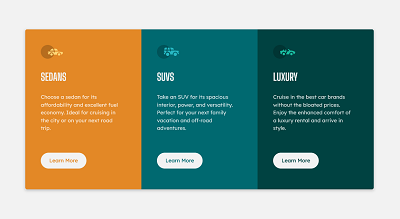

# Frontend Mentor - 3-column preview card component solution

This is a solution to the [3-column preview card component challenge on Frontend Mentor](https://www.frontendmentor.io/challenges/3column-preview-card-component-pH92eAR2-).

## Table of contents

- [Overview](#overview)
  - [The challenge](#the-challenge)
  - [Screenshot](#screenshot)
  - [Links](#links)
- [My process](#my-process)
  - [Built with](#built-with)
  - [Thoughts](#thoughts)
  - [Useful resources](#useful-resources)
- [Author](#author)

## Overview

### The challenge

Guideline provided by Frontend mentor:

- Users should be able to:
  - View the optimal layout depending on their device's screen size
  - See hover states for interactive elements

### Screenshot

### Links

- [Solution on Github](https://github.com/1codingguy/frontend-mentor/tree/main/3-column-preview-card-component-main)
- [Live site on Github Pages](https://1codingguy.github.io/frontend-mentor/3-column-preview-card-component-main/)

## My process

### Built with

- HTML5
- SCSS

### Thoughts

1. Some details are not mentioned in the style guide, e.g.:

- border-radius
- box-shadow

  I am sure there are some tiny details my eyes couldn't spot and therfore failed to include in this solution.

2. Tried to name the classes with [BEM naming convention](http://getbem.com/naming/), but not entirely sure if I got it correct.

3. Read somewhere that a good README file is as important as the project itselfs. So from now on I will make sure to include a README file in every project/ challenge. I reckon it will also help me reviewing the projects somewhere in the future.

### Useful resources

- [CSS Scan](https://getcssscan.com/css-box-shadow-examples) - This site provides samples of different box-shadow. Able to see the result and simply copy and paste into own's CSS. Very helpful since I am not that familar with the box-shadow properites.

## Author

- coding-guy - [My Github page](https://github.com/1codingguy)
